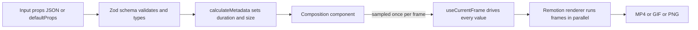

# remotion-video-templates

Six programmatic video templates in [Remotion](https://www.remotion.dev) — logo intro, lower thirds, kinetic typography, data-driven charts, TikTok-style captions, and a product promo — all customizable through typed props.


## Why

Motion-graphics work is repetitive: the same lower-third for every guest, the same intro with a different logo, the same chart with next quarter's numbers. Doing it by hand in After Effects means re-opening a project and nudging keyframes every single time.

Remotion turns a video into a React component that is a pure function of its props, so you render variants from the command line or a CI job instead of a timeline. This repo is a pack of six such components — each one finished, typed with a Zod schema so [Remotion Studio](https://www.remotion.dev/docs/studio) gives you an editable form, and driven entirely by `useCurrentFrame()` so renders are deterministic. Fork it, point the props at your data, and render.

## Templates

| Composition id   | Size       | Duration            | Key props |
|------------------|------------|---------------------|-----------|
| `LogoIntro`      | 1920×1080  | 3s (fixed)          | `logoSrc`, `brandColor`, `accentColor`, `particleCount` |
| `LowerThirds`    | 1920×1080  | derived from timing | `name`, `role`, `accentColor`, `enter/hold/exitDurationInFrames` |
| `KineticText`    | 1920×1080  | derived from lines  | `lines: [{ text, emphasis? }]`, `textColor`, `emphasisColor` |
| `BarChartRace`   | 1920×1080  | derived from data   | `title`, `steps[]`, `series: [{ label, color, values[] }]` |
| `LineChartDraw`  | 1920×1080  | derived from data   | same data shape as `BarChartRace` |
| `CaptionedShort` | 1080×1920  | derived from timings| `captions: [{ word, startMs, endMs }]`, `mode`, `wordsPerGroup`, `accentColor` |
| `PromoTemplate`  | 1920×1080  | derived from scenes | `productName`, `tagline`, `features[]`, `screenshots[]`, `cta` |

Six templates, seven compositions — `ChartVideo` ships two (`BarChartRace` and `LineChartDraw`) that read the exact same data shape.

## How it renders



The renderer samples each composition at frame 0, 1, 2, … often across several CPU processes at once. That is why **every visual has to be a pure function of the frame** — the same frame must always produce the same pixels. Two consequences drive the whole codebase, and they are exactly the two things Remotion beginners get wrong (see [Two patterns worth understanding](#two-patterns-worth-understanding)).

## Quickstart

No accounts, no API keys, no GPU — everything renders on your machine.

```bash
git clone https://github.com/AleBrito124356/remotion-video-templates.git
cd remotion-video-templates
npm install

# Optional: only if you want to tune render concurrency
cp .env.example .env

# Open the interactive studio (preview + live prop editor)
npm run studio
```

Studio opens at `http://localhost:3000`. Pick a composition in the left sidebar, edit its props in the right-hand form (colors get a picker, arrays get add/remove rows), and scrub the timeline. When it looks right, copy the props and render from the CLI.

## Rendering

Every template renders with `npx remotion render <id> <out> --props=<json-or-file>`. Props you omit fall back to the composition's `defaultProps`.

```bash
# Logo intro with your brand colors and a denser particle burst
npx remotion render LogoIntro out/logo.mp4 \
  --props='{"brandColor":"#7C3AED","accentColor":"#F472B6","particleCount":44}'

# A single lower-third styled for a guest
npx remotion render LowerThirds out/lower.mp4 \
  --props='{"name":"Ada Lovelace","role":"Founder, Analytical Engines","accentColor":"#0EA5E9"}'

# Kinetic typography — duration auto-fits the script
npx remotion render KineticText out/kinetic.mp4 \
  --props='{"lines":[{"text":"You do not need an editor."},{"text":"You need code."},{"text":"Ship it.","emphasis":true}]}'

# Charts from a data file (see src/templates/ChartVideo/sample-data.ts for the shape)
npx remotion render BarChartRace out/bars.mp4  --props=./my-data.json
npx remotion render LineChartDraw out/lines.mp4 --props=./my-data.json

# Vertical short with karaoke captions, one word at a time
npx remotion render CaptionedShort out/short.mp4 --props='{"mode":"single","accentColor":"#22D3EE"}'

# Product promo (uses the placeholder screenshots in public/ by default)
npx remotion render PromoTemplate out/promo.mp4
```

Expected output, roughly:

```
$ npx remotion render LogoIntro out/logo.mp4
 Bundling  100% [====================]
 Rendering 100% [====================]  90/90 frames
 Encoded   out/logo.mp4  (3.0s, 1920x1080, h264)
```

> Windows PowerShell escapes JSON differently. Either put the props in a file and pass `--props=./props.json`, or double the quotes. On macOS/Linux the single-quoted form above works as-is.

Other handy commands:

```bash
npx remotion compositions               # list every composition id
npx remotion still LogoIntro out/thumb.png --frame=45   # one frame as a PNG
npx remotion render LineChartDraw out/lines.gif --codec=gif
```

## Two patterns worth understanding

These are the two places new Remotion users trip, and both are demonstrated in the code.

### 1. Seeded randomness, never `Math.random()`

`Math.random()` returns a different number on every call. Because frames render in parallel and out of order, calling it inside a component makes particles jump around between frames and flicker in the final video. The fix is a **seeded** PRNG so the "random" value for a given element is identical on every render pass.

`LogoIntro` bursts particles outward using Remotion's `random(seed)`:

```tsx
import { random } from "remotion";

// Deterministic per-particle values — same seed, same number, every frame.
const angle = random(`angle-${i}`) * Math.PI * 2;
const distance = 140 + random(`dist-${i}`) * 360;
const size = 5 + random(`size-${i}`) * 13;
```

Same idea applies to `Date.now()`, `new Date()`, `setInterval`, and CSS animations — all forbidden inside render. Express time as `useCurrentFrame()` and randomness as `random(seed)`.

### 2. `calculateMetadata` — let the data set the duration

A caption track is however many seconds the audio is. A kinetic script with six lines needs more frames than one with two. Hard-coding `durationInFrames` on the `<Composition>` and hoping it matches is the classic mistake. Instead, derive it:

```tsx
export const kineticTextCalculateMetadata = ({ props }) => {
  const { totalDuration } = layoutKinetic(props.lines);   // same function the component uses
  return { durationInFrames: totalDuration };
};
```

`KineticText`, `CaptionedShort`, `LowerThirds`, both charts, and `PromoTemplate` all compute their length from their props this way. The important detail: the timeline math lives in **one** function that both `calculateMetadata` and the component call, so the declared duration can never drift from what actually gets drawn.

## Project structure

```
remotion-video-templates/
├── src/
│   ├── index.ts                      # registerRoot entry point
│   ├── Root.tsx                       # declares all 7 compositions
│   ├── lib/
│   │   ├── springs.ts                 # SNAPPY / GENTLE / BOUNCE spring presets
│   │   ├── colors.ts                  # zinc + blue palette, chart colors, alpha/mix helpers
│   │   ├── fonts.ts                   # Inter via @remotion/google-fonts
│   │   └── layout.tsx                 # AbsoluteFill helpers + safe-area math
│   └── templates/
│       ├── LogoIntro/LogoIntro.tsx    # spring reveal, mask wipe, seeded particles
│       ├── LowerThirds/               # 3 styles + a demo that sequences them
│       │   ├── styles.tsx
│       │   └── LowerThirds.tsx
│       ├── KineticText/KineticText.tsx
│       ├── ChartVideo/
│       │   ├── sample-data.ts         # shared schema + sample dataset
│       │   ├── BarChartRace.tsx       # interpolated-rank bar race
│       │   └── LineChart.tsx          # SVG path-length draw-on
│       ├── CaptionedShort/CaptionedShort.tsx
│       └── PromoTemplate/PromoTemplate.tsx
├── public/
│   ├── logo.svg                       # sample mark for LogoIntro
│   ├── screenshot-1.svg               # placeholder app screenshots for the promo
│   ├── screenshot-2.svg
│   └── captions.sample.json           # word-timed transcript for CaptionedShort
├── remotion.config.ts
├── tsconfig.json
└── .github/workflows/render.yml       # CI: typecheck + render + upload artifact
```

## Generating your own captions

`CaptionedShort` reads `public/captions.sample.json` in the shape `[{ word, startMs, endMs }]`. To make your own from an audio file, transcribe with word-level timestamps using [OpenAI Whisper](https://github.com/openai/whisper) (or [whisper.cpp](https://github.com/ggerganov/whisper.cpp) / [faster-whisper](https://github.com/SYSTRAN/faster-whisper)) and map each token to `{ word, startMs, endMs }`. Timestamp generation is intentionally out of scope here — this template only consumes the JSON.

## CI rendering

`.github/workflows/render.yml` runs on every push: it installs deps, runs `npx remotion browser ensure` to fetch the headless Chromium build, typechecks, renders a composition, and uploads the MP4 as a workflow artifact. Trigger it manually from the Actions tab with a `composition` input to render any id on demand. For high-volume or personalized batches, render off a dataset with the [server-side renderer](https://www.remotion.dev/docs/renderer) (`bundle()` → `selectComposition()` → `renderMedia()` in a loop) or [Remotion Lambda](https://www.remotion.dev/docs/lambda).

## Related projects

Part of a family of open-source tools by the same author:

- [blender-python-toolkit](https://github.com/AleBrito124356/blender-python-toolkit) — headless Blender automation: procedural scenes, product turntables, and data-driven 3D charts from the command line.
- [tailwind-landing-sections](https://github.com/AleBrito124356/tailwind-landing-sections) — copy-paste Tailwind landing sections in the same clean light aesthetic used across these templates.
- [nextjs-ai-chat-template](https://github.com/AleBrito124356/nextjs-ai-chat-template) — a production-shaped Next.js 15 AI chat starter with streaming, no dark-neon anywhere.
- [python-automation-toolbox](https://github.com/AleBrito124356/python-automation-toolbox) — 20 standalone Python scripts for real-life automation, each self-contained with argparse.

## License

MIT © 2026 Alejandro Brito
